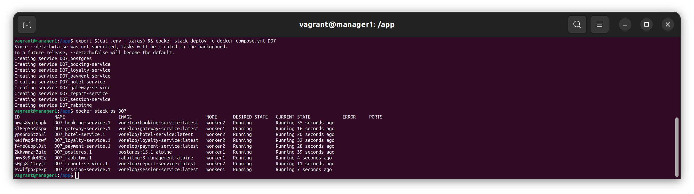
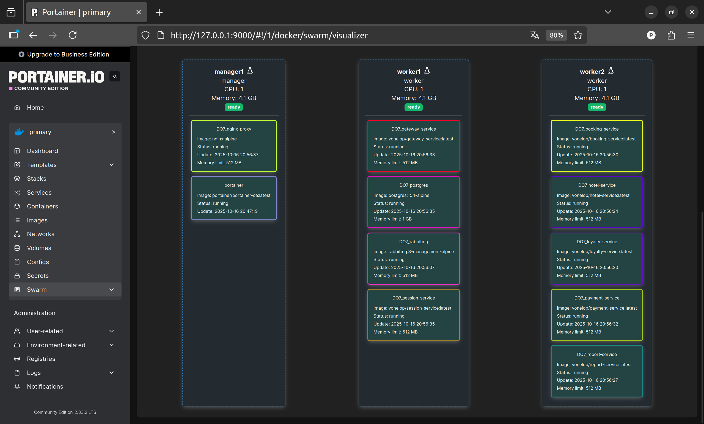

## Запуск нескольких Docker-контейнеров с использованием Docker Compose
- Напишем Dockerfile-ы для 7 сервисов. В качества примера приведу Dockerfile для сервиса gateway

- Проверим размер каждого собранного образа

- Напишем Docker-compose для сервисов и хранилищ данных (PostgreSQL, RabbitMQ)

- Запустим приложение

- Убедимся, что приложение корректно работает

- Запустим заготовленные тесты через postman

## Создание виртуальных машин
- Напишем Vagrantfile для создания одно вм

- Напишем скрипт, для установки необходимых программ и для запуска dcoker-compose файла

- Запустим вм при помощи комагды `vagrant up --provider virtualbox` и проверим, что вм запустилась

- Зайдем на вм и убедимся, что исходный код скопировался в нужное место. А так же проверим, что приложение поднялось и все контейнеры работают

## Создание простейшего Docker Swarm
- Модифицируем Vagrantfile. Добавим три define, а именно manager1, worker1, worker2

- Напишем скрипты для установки docker, настройки swarm кластера

- Загрузим собранные образы на Docker Hub

- Модифицируем docker-compose.yml

- Поднимем ноды при помощи vagrand

- Запустим сервисы на виртуальных машинах. Проверим что они работают на разных нодах

- Допишем docker-compose.yml, добавим сервис nginx

- Создадим конфигурационный файл nginx

- Запустим стак сервисов, проверим что они запущены

- Запустим заготовленные тест через Postman

- Убедимся, что сервисы распределены по узлам

- Визуализация при помощи Portiner
